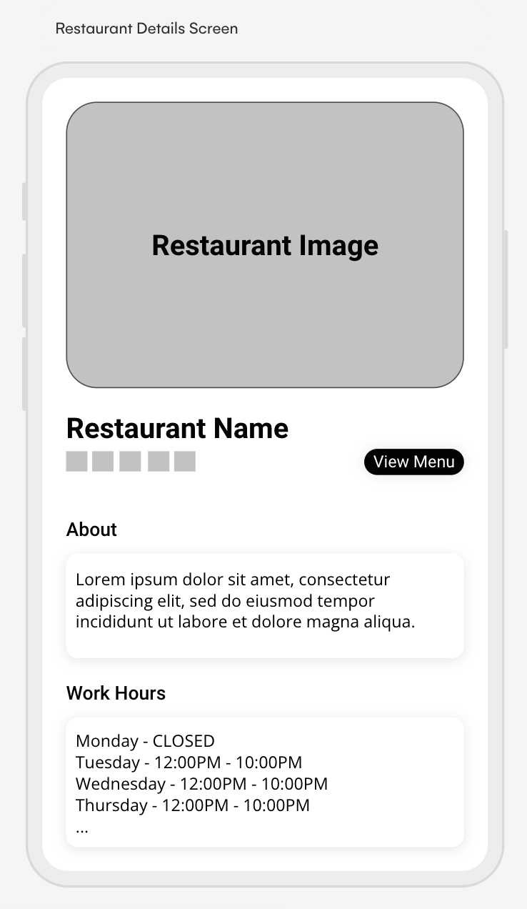
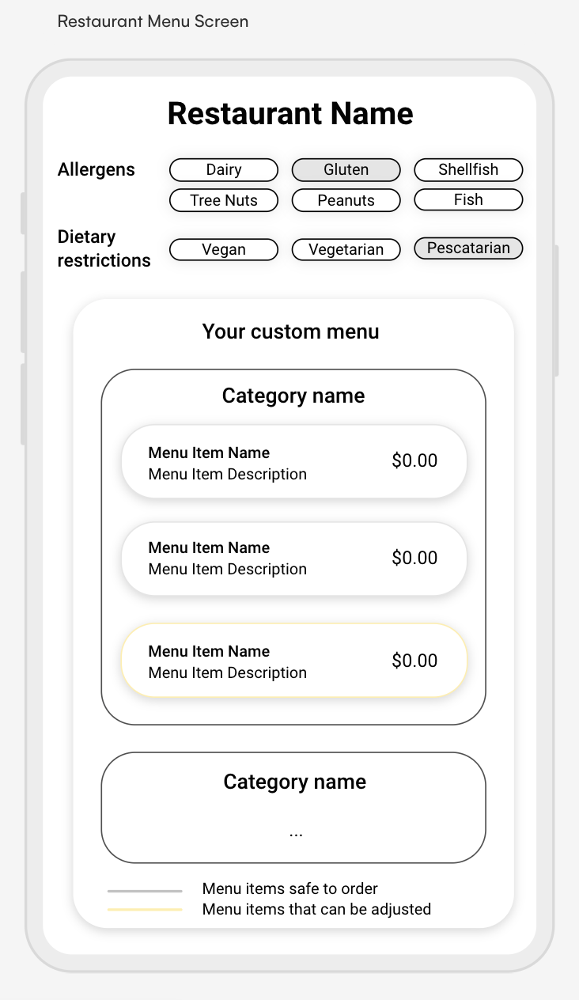
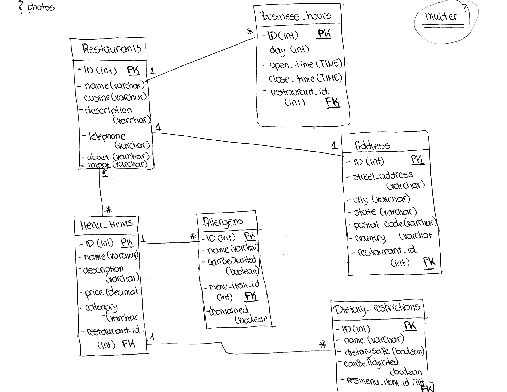

# Peanut

## Overview

Peanut is an application that allows individuals with allergies to confidently explore restaurant menus. Users can effortlessly select a restaurant, input their allergies, and receive a personalized, formatted menu featuring only those options safe for them. This ensures and seamless dining experience tailored to their dietary needs, leaving no room for error.

### Problem

Coming from a background in hospitality, I am well-aware of the potential dangers stemming from unclear menu items and possible allergen misidentifications by restaurant staff. This application serves as a dependable source of truth, offering both users and restaurant staff a reliable tool to ensure a secure and well-informed dining experience for individuals with allergies.

### User Profile

The primary users of the app are restaurant patrons with allergies or dietary restrictions. Upon opening the app, they can easily select a restaurant and input their specific allergens, generating a customized menu tailored to their dietary needs. 

The app serves as a valuable tool for restaurant staff as well. Through its use, they can confidently access and present allergen-specific menus, reducing the likelihood of mistakes in food preparation and enhancing overall customer satisfaction.

Special considerations: the app focuses on the most common food allergens. Users are advised to communicate any particular allergens directly with the restaurant servers to ensure a comprehensive understanding and a safe dining experience.

### Features

1. Discover Nearby Restaurants:
- Fetch a list of restaurants located in the user's vicinity.
- Preview essential information about each restaurant, such as location and contact details.

2. Explore Allergen-Specific Menus:
- Access detailed information about a selected restaurant.
- View the restaurant's complete menu.
- Input specific allergens to generate a customized menu.
- Present the customized menu with allergen-friendly options clearly identified.

## Implementation

### Tech Stack

Front-end technology:
- React: The app's user interface will be implemented using React for its component-based architecture and efficient rendering.

Back-end technology:
- Node.js: The server-side of the application will be built using Node.js

Database:
- MySQL: The relational database management system MySQL will be used to store and manage restaurant, menu, and user information.

Libraries and Frameworks:
- Express.js: This minimal and flexible Node.js web application framework will be utilized to simplify the creation of the app's server-side logic and routing.
- OAuth and Passport: For user authentication, OAuth combined with Passport.js will enhance security and provide a standardized authentication mechanism.
- Knex.js: As a SQL query builder for Node.js, Knex.js will be used to interact with the MySQL database, streamlining database queries and migrations.
- Axios: To facilitate HTTP requests between the front-end and back-end, Axios can be employed for its simplicity and ease of use.
- Google Maps React: To integrate Google Maps into the application and add custom markers.

### APIs

The application relies primarily on internal data, supplemented by the integration of the Google Maps API for embedding Google Maps functionality.

### Sitemap

1. Landing Page:
- Description: Users can view nearby restaurants, search for specific ones, and filter by category.

2. Restaurant Details Page:
- Description: After selecting a restaurant, users can access detailed information such as name, location, contact details, price range, and reviews.

3. Menu Details Page:
- Description: Users can explore the restaurant's menu with custom allergy filters, dynamically altering the menu to display options safe for them to consume.

### Mockups

### Data

1. Restaurant Data:
- id (Primary Key): Unique identifier for each restaurant.
- name: Name of the restaurant.
- location: Location of the restaurant.
- contact: Contact information for the restaurant.

2. Menu Item Data:
- id (Primary Key): Unique identifier for each menu item.
- name: Name of the menu item.
- description: Description of the menu item.
- price: Price of the menu item.
- restaurant_id (Foreign Key): Links to the id in the Restaurant table

3. Allergen Data:
- id (Primary Key): Unique identifier for each allergen.
- name: Name of the allergen.
- canBeOmitted: Indicates whether the allergen can be omitted from the menu item.
- menu_item_id (Foreign Key): Links to the id in the Menu Item table

### Endpoints

TBD

### Auth

TBD

## Roadmap

#### 2-Week Sprint Plan

#### Week 1: Construct Backend and Initial Frontend (Days 1-7)

Days 1-3: Backend Setup
- Task: Initialize a Node.js server using Express.
    - Install necessary dependencies.
    - Configure basic server settings.
    - Set Up Database 
- Task: Establish a MySQL database for the application.
    - Create tables (Restaurant, MenuItem, Allergen).
    - Define relationships between tables.
    - Create Basic Routes 
- Task: Develop initial API routes for basic functionality.
    - Implement routes for retrieving restaurant data.
    - Implement basic routes for menu items.

Days 4-7 Frontend Setup
- Task: Initialize the React frontend.
    - Set up the project structure.
    - Create basic React components.

#### Week 2: Complete Frontend and Testing (Days 8-14)

Days 8-10: Connect Frontend to Backend
- Task: Establish communication between the front end and the back end.
    - Utilize Axios for making API requests.
    - Test API endpoints and handle responses.

10-12: Frontend Development and Basic Testing
- Task: Develop and refine React components for a cohesive user interface.
    - Implement reusable components.
    - Ensure proper data rendering from the backend.
    - Conduct initial testing of both backend and frontend functionalities.

Day 13: Bug Fixing and Optimization

## Nice-to-haves

User Account Creation: Allow users to create accounts

User Account Update: Allow users to update information for their accounts

Comments/Rating : Allow users to leave reviews and/or rate the restaurant

